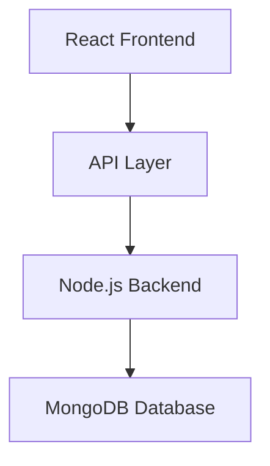
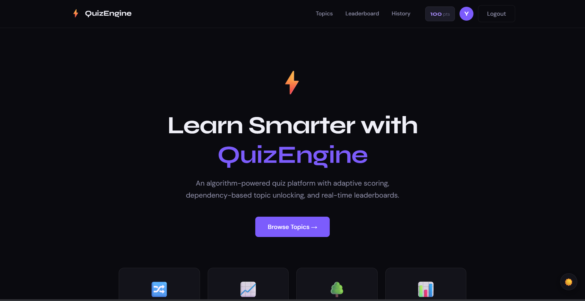
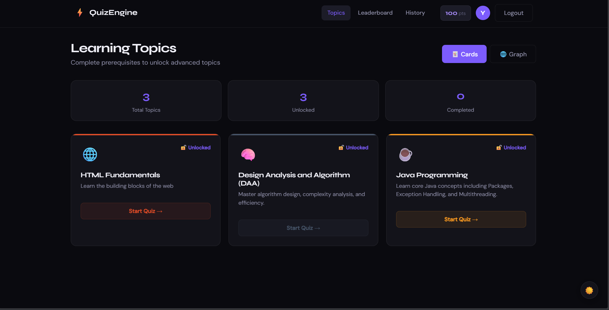
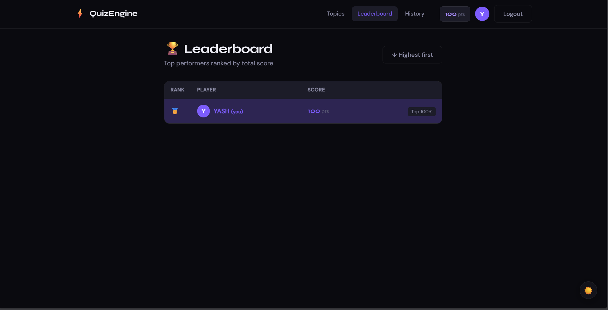

# ⚡ QuizEngine

### *An Intelligent Algorithm-Driven Quiz Platform*

<p align="center">
  <b>Adaptive Learning • Real-Time Scoring • Graph-Based Progression</b>
</p>

<p align="center">
  
  
  
  
  
</p>

---
## 📁 Project Structure

```
quizengine/
├── backend/
│   ├── algorithms/
│   │   ├── shuffle.js       ← Fisher–Yates shuffle
│   │   ├── scoring.js       ← Greedy streak scoring engine
│   │   ├── sorting.js       ← Leaderboard & difficulty sort
│   │   └── graph.js         ← Topological sort, unlock logic
│   ├── config/
│   │   └── db.js            ← MongoDB connection
│   ├── controllers/
│   │   ├── authController.js
│   │   ├── quizController.js
│   │   ├── topicController.js
│   │   ├── questionController.js
│   │   └── leaderboardController.js
│   ├── data/
│   │   └── seed.js          ← Seed script (6 topics, 30 questions)
│   ├── middleware/
│   │   └── auth.js          ← JWT protect + admin middleware
│   ├── models/
│   │   ├── User.js
│   │   ├── Topic.js         ← Graph nodes
│   │   ├── Question.js
│   │   └── QuizAttempt.js
│   ├── routes/
│   │   ├── auth.js
│   │   ├── quiz.js
│   │   ├── topics.js
│   │   ├── questions.js
│   │   ├── leaderboard.js
│   │   └── users.js
│   ├── server.js
│   ├── Dockerfile
│   └── package.json
│
├── frontend/
│   ├── public/index.html
│   ├── src/
│   │   ├── components/
│   │   │   ├── Graph/
│   │   │   │   ├── TopicGraph.jsx   ← Interactive SVG graph
│   │   │   │   └── TopicCard.jsx
│   │   │   └── UI/
│   │   │       ├── Navbar.jsx
│   │   │       └── Navbar.module.css
│   │   ├── context/
│   │   │   └── AuthContext.jsx      ← Global auth state
│   │   ├── pages/
│   │   │   ├── HomePage.jsx
│   │   │   ├── LoginPage.jsx
│   │   │   ├── RegisterPage.jsx
│   │   │   ├── TopicsPage.jsx
│   │   │   ├── QuizPage.jsx         ← Main quiz experience
│   │   │   ├── ResultsPage.jsx
│   │   │   ├── LeaderboardPage.jsx
│   │   │   └── HistoryPage.jsx
│   │   ├── styles/
│   │   │   └── global.css           ← Design system tokens
│   │   ├── utils/
│   │   │   ├── api.js               ← Axios instance
│   │   │   └── algorithms.js        ← Client-side algorithm mirrors
│   │   ├── App.jsx
│   │   └── index.jsx
│   ├── Dockerfile
│   ├── nginx.conf
│   └── package.json
│
├── docker-compose.yml
└── README.md
```

---
## 🚀 Overview

**QuizEngine** is a full-stack, algorithm-powered quiz platform designed to deliver a **smart, adaptive, and engaging learning experience**.

It combines:

* 🧠 **Data Structures & Algorithms**
* ⚡ **Real-time interaction**
* 🌐 **Modern full-stack architecture**

to create a **production-ready intelligent learning system**.

---

## ✨ Key Highlights

* ⚡ Algorithm-driven quiz logic
* 🔗 Graph-based topic unlocking (DAG)
* 📊 Real-time leaderboard system
* 🔐 Secure authentication (JWT)
* 🐳 Docker-ready deployment

---

## 🧠 Core Features

### 🧠 Smart Algorithms

* Fisher–Yates Shuffle (O(n), unbiased randomization)
* Greedy scoring with streak bonuses
* DAG-based topic progression (Topological Sort)
* Multi-condition sorting system

---

### 🎮 Interactive Experience

* Real-time quiz interface
* Countdown timer + progress tracking
* Smooth UI transitions
* Dark/Light mode support
* Fully responsive design

---

### 🔐 Security & Authentication

* JWT-based authentication system
* Protected routes & middleware
* Admin-controlled data operations

---

### 📊 Analytics & Performance

* Dynamic leaderboard ranking
* Quiz history tracking
* Score visualization
* Performance-based topic unlocking

---

## 🏗️ System Architecture



---

## 🧠 Algorithm Engine (Core Strength)

### 🔀 Fisher–Yates Shuffle

Ensures true randomness in quiz sessions with O(n) complexity.

---

### ⚡ Greedy Scoring Logic

* +5 → Correct
* −1 → Incorrect (min = 0)
* 🔥 Streak bonuses:

  * 3 correct → +2
  * 5 correct → +5

---

### 🔗 Topological Sort (DAG)

* Topic unlocking based on prerequisites
* Ensures structured learning progression
* Implemented using Kahn’s Algorithm

---

### 📊 Advanced Sorting

* Leaderboard → score desc + name tie-break
* Questions → difficulty-based ordering
* Multi-field comparator system

---

## 🏗️ Learning Path Graph

```
HTML → CSS → JavaScript → React
                     ↘
                      Node.js → Full Stack
```

---

## 📸 Screenshots
<h3 align="center">📸 Application Preview</h3>
<p align="center">
  <br><br>
  <br><br>
  
</p>

## 🌐 Live Demo

👉 https://your-app-link

---

## ⚙️ Installation Guide

### 🔹 Backend Setup

```bash id="bk1"
cd backend
cp .env.example .env
npm install
npm run seed
npm run dev
```

---

### 🔹 Frontend Setup

```bash id="fr1"
cd frontend
npm install
npm start
```

---

## 🐳 Docker Deployment

```bash id="dk1"
docker-compose up --build
docker-compose exec backend node data/seed.js
```

---

## 💡 Why This Project?

✔ Combines **DSA + Full Stack Development**
✔ Demonstrates **real-world system design**
✔ Implements **scalable architecture**
✔ Showcases **problem-solving + engineering thinking**

---

## 🚀 Future Enhancements

* 🤖 AI-based adaptive difficulty
* 🌐 Multiplayer quiz system
* ⚡ WebSocket real-time updates
* 📊 Advanced analytics dashboard
* 📱 Mobile app version

---

## 👨‍💻 Author

**Rahul Raj Jaiswal**
💼 LinkedIn: https://www.linkedin.com/in/rahulrajjaiswal/

---

## 📄 License

This project is licensed under the MIT License.
